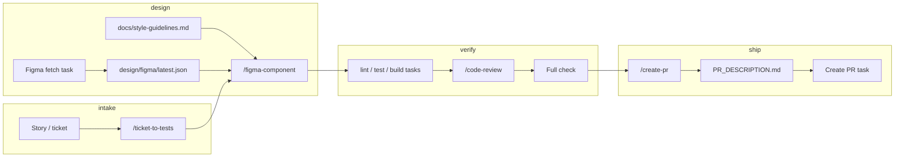

# Integrated workflow — how everything connects

This repo is a **bundle**: VS Code tasks, shell scripts, Copilot slash prompts, and design docs are meant to run **in order** so output stays traceable from ticket → UI → tests → PR.

## The spine (one feature)

| Phase | What you use | What lands on disk |
|--------|----------------|---------------------|
| **1. Volume / clarity** | Paste the story or ticket into Copilot → **`/ticket-to-tests`** | Structured test cases (IDs, steps, expected); optionally generated unit/e2e tests mapped to those IDs |
| **2. Design sync** | **`FIGMA_*`** in `.env`, then task **Figma: fetch full file** or **Figma: fetch nodes** (or `node scripts/workflows/figma-sync.mjs fetch …`) | **`design/figma/latest.json`** (API snapshot) |
| **3. Style contract** | Humans edit **`docs/style-guidelines.md`** (tokens, type, spacing, component map, Figma URLs) | Single source of truth for **`/figma-component`** and reviewers |
| **4. UI in code** | Copilot → **`/figma-component`** (after fetch + guidelines) | Real components under your app tree |
| **5. Closure / green** | **Run Task:** **test** (and **lint** / **build** as needed) | CI-local proof the artifact works |
| **6. Governance** | **`/code-review`** (AI) + **Code review** task (lint + **`forbid:`** in `.github/code-review-rules.md`) | Fixes until checks pass |
| **7. Pre-ship** | **Full check** or **Pre-PR check** | Same gates your automation uses |
| **8. Ship** | **`/create-pr`** → save body to **`.github/PR_DESCRIPTION.md`** → **Run Task: Create PR** | PR opens with title/body from the file |

Optional: record a short **Playwright** or **Cypress** run-through and attach to the PR so reviewers see the app exercised (not required by the workflow).

## How the pieces stick together

- **`docs/style-guidelines.md`** is the **human + Copilot contract**. Figma JSON alone does not encode your token names or “use `Button` from `@/ui`”; the guidelines file does.
- **`design/figma/latest.json`** is **machine input** from Figma’s REST API. Refresh it when design changes; **`/figma-component`** reads it together with the style doc.
- **Tasks** are the **non-negotiable verify loop**: same commands whether you use Copilot or not.
- **Slash commands** are the **accelerators**: they generate or refactor text/code but **tasks** prove it still runs.
- **`forbid:`** rules + **`/code-review`** align **automated grep** with **AI review** so governance is not only chat.

## First-time setup in a target repo

1. Run **`./scripts/copy-to-repo.sh /path/to/your/repo`** from this workflows repo (copies tasks, prompts, scripts, **`docs/style-guidelines.md`**, **Figma** docs, **`.env.example`**).
2. Point **`tasks.json`** at your real **`npm`** / **`pnpm`** scripts for lint, test, build.
3. Fill **`docs/style-guidelines.md`** for your product (even a minimal table is enough to align **`/figma-component`**).
4. Add **`.env`** with **`FIGMA_ACCESS_TOKEN`** (and optional **`FIGMA_FILE_KEY`**) if you use Figma fetch — see **[Figma-API-Workflow.md](./Figma-API-Workflow.md)**.

## Reference links

| Topic | Doc |
|--------|-----|
| Figma token, file key, `figma-sync.mjs` | [Figma-API-Workflow.md](./Figma-API-Workflow.md) |
| Tokens and component map | [style-guidelines.md](./style-guidelines.md) |
| VS Code tasks and slash commands | [README.md](../README.md) |
